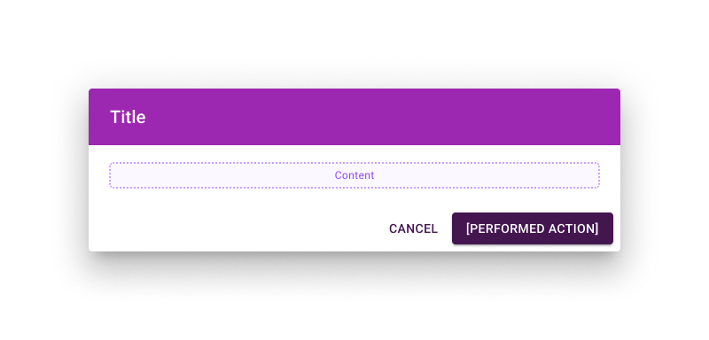
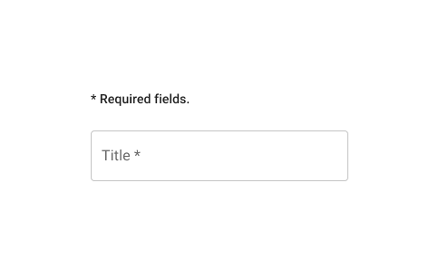



# 
{: .no_toc }

## 
{: .no_toc .text-delta }

- TOC
{:toc}

## 

## 

## 

> 💡 


* 

    > 

* 

    > 

* 

    

    > 
    >
    > 



    > 🚧 

## 



## 


* 
* 

    > 

* 

## 

### 
{: .no_toc }

- 

### 
{: .no_toc }

- 

    > 

### 
{: .no_toc }

- 
- 

    > 

- 

### 
{: .no_toc }

- 
- 

## 
