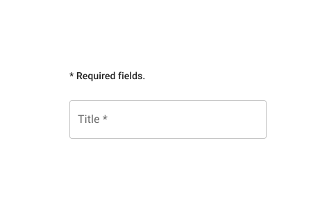

# UX/UI Guidelines
{: .no_toc }

## Table of contents
{: .no_toc .text-delta }

- TOC
{:toc}

## General page template

## Data grid

## Dialog

> 💡 Use the [Dialog](https://mui.com/material-ui/react-dialog/) component instead of a [modal](https://mui.com/material-ui/react-modal/). The modal is the low-level element meant to block the interaction. The Dialog is based on a modal, but specializes in providing information and further actions.

A Dialog is composed of three main parts:
* **Title**. Contain a brief, clear statement or question. It should communicate the Dialog's purpose.

    > Background color is `secondary`.

* **Content**. Anything needed for the context, from supporting text to full-size form. 

    > With long content, use the [`scroll=paper`](https://mui.com/material-ui/react-dialog/#scrolling-long-content).

* **Actions**. There's always a way to go back (*Cancel*). And the main action is on the right. The label should reflect the action performed when clicked.

    If any [required field](https://pankosmia.dev/uxui-guidelines/#required-fields) is in the content, the action button is disabled until they are completed.

    > *Cancel*. Text button, primary color.
    >
    > *Action*. Contained button, primary color.

Responsiveness is configured as follow:

    > 🚧 TBD (full-width + variable maxWidth depending on breakpoints?).

## Icons

[Material Icons](https://mui.com/material-ui/material-icons/?theme=Outlined) should be in the `Outlined style` by default.

## Required fields

When information is required to proceed:
* Required field(s) should show an asterisk `*` after the label.
* Above required field(s), explain what the asterisk does. This message is displayed once, after any title and before required field(s).

    > Add `* Required fields.`, with the typography style `subtitle2`.

* The action button below the field(s) is enabled only when all required fields are completed.

## Theme

### Main colors
{: .no_toc }

- You can find matching primary and secondary colors using a palette generator like [Coolors](https://coolors.co/d4e09b-f6f4d2-cbdfbd-f19c79-a44a3f). If you already have a primary color in mind, you can also generate a matching secondary color with a [Color Wheel](https://www.figma.com/color-wheel/).

### Generate MUI color variants for *theme.json*
{: .no_toc }

- Use the [MUI Theme Creator](https://zenoo.github.io/mui-theme-creator/). On the bottom-right you can edit a `main` color to automatically generate its `light` and `dark` variants, and the corresponding `contrastText` color.

    > Note those are different from a light/dark app theme. They are a lighter and darker shade of the main color. You can use them to play with contrast in the interface.

### Check contrast
{: .no_toc }

- It's a good practice to [check contrast](https://app.contrast-finder.org/?lang=en). Online palette and color tools tend to rely on varying contrast standards. Better to double check and choose which contrast standard you want to aim for.
- MUI uses colors in different contexts. To prevent any issue, try your colors' contrasts accordingly. Check primary and secondary as text for both white and black background.

    > Note that you don't necessarily need your colors to have a good contrast with white **and** black out-of-the-box. This is to make sure light and dark mode will work. But colors can also be further adjusted to better work in a specific mode.

- It's good to have some contrast between primary and secondary. You don't need a standard-level contrast. But a secondary component on a primary background can be a thing (like a badge with number of notifications). If primary and secondary are too close, the interface will become less clear.

### Generate *appbar-chip-inactive* colors
{: .no_toc }

- If your primary color is **darker** than your secondary. Use `secondary dark` as `appbar-chip-inactive main` and [Generate MUI color variants](https://pankosmia.dev/uxui-guidelines/#generate-mui-color-variants-for-themejson) from it.
- If your primary color is **lighter** than your secondary. Use `secondary light` as `appbar-chip-inactive main` and [Generate MUI color variants](https://pankosmia.dev/uxui-guidelines/#generate-mui-color-variants-for-themejson) from it.

## Tooltip
